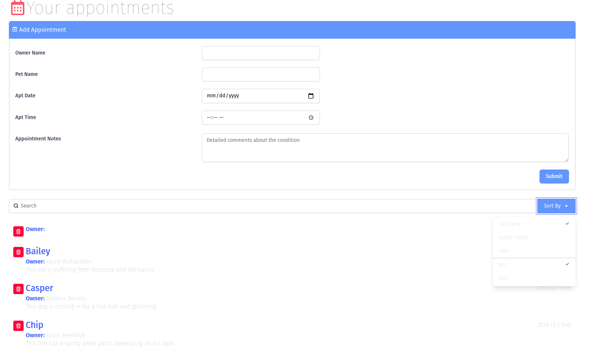

# Following "React.js Building an Interface" course on Linkedin Learning

<table>
<tr>
<td>


</td>
<td>



</td>
</tr>
</table>

This project was the result of follwing this course with [React.js Building an Interface](https://www.linkedin.com/learning/react-js-building-an-interface-8551484).

### Run

```bash
yarn install
yarn start
```
